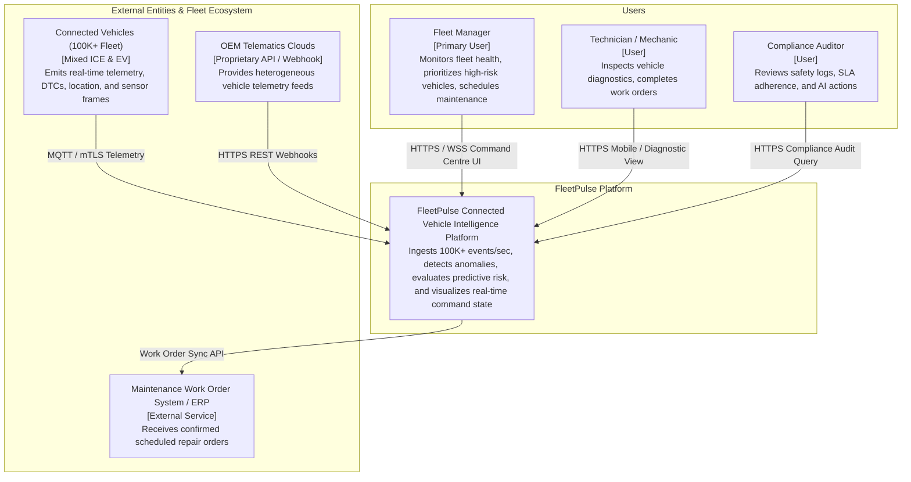
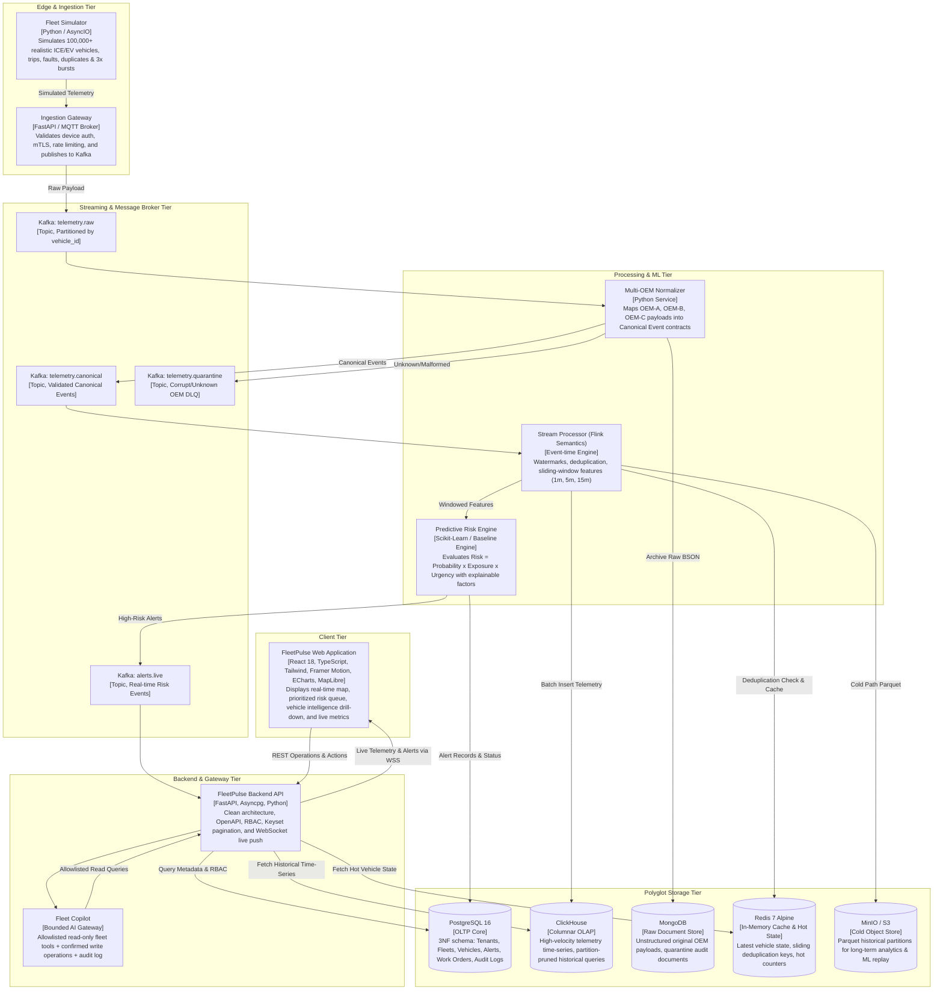
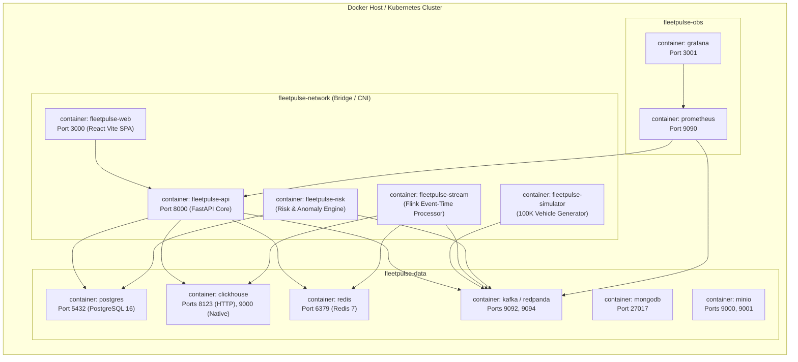

# FleetPulse — C4 Architecture Specification

## 1. System Context Diagram (C4 Level 1)

---

## 2. Container Diagram (C4 Level 2)

---

## 3. Deployment Diagram (C4 Level 3 — Docker Compose & Cloud Kubernetes)

