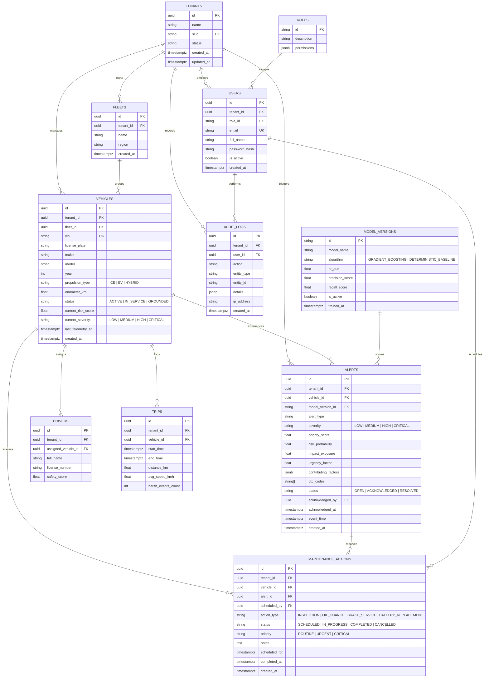

# FleetPulse — Database Entity Relationship (ER) & Schema Specification

## 1. Relational 3NF Schema (PostgreSQL 16)

---

## 2. Polyglot Store Schema Mapping

| Store | Collection / Table | Purpose & Structure |
| :--- | :--- | :--- |
| **PostgreSQL** | `vehicles`, `alerts`, `maintenance_actions`, `audit_logs` | Relational 3NF with foreign keys, compound indexes: `idx_vehicles_tenant_risk (tenant_id, current_risk_score DESC)`, `idx_alerts_tenant_status (tenant_id, status, severity)`. |
| **ClickHouse** | `telemetry_events` | Optimized columnar table with `ENGINE = MergeTree() PARTITION BY toYYYYMM(event_time) ORDER BY (tenant_id, vehicle_id, event_time)`. Includes `engine_temp`, `speed_kmh`, `soc_pct`, `odometer_km`, `lat`, `lon`, `dtc_codes`, timestamps. |
| **ClickHouse** | `hourly_vehicle_stats` | Pre-aggregated table with `ENGINE = SummingMergeTree()` for immediate fleet-wide charts without scanning raw ticks. |
| **MongoDB** | `raw_telemetry` | Stores raw BSON objects `{ "event_id": UUID, "oem": "OEM_A", "raw_payload": {...}, "ingest_time": ISODate }` with 30-day TTL index. |
| **MongoDB** | `quarantined_events` | Stores malformed or corrupted events rejected during schema normalization with failure reason. |
| **Redis** | `vehicle:{id}:latest` | Hash storing latest sensor values, current GPS coordinates, status, and latest priority score for instant frontend delivery. |
| **Redis** | `dedup:events:{event_id}` | String key with 3600-second TTL ensuring exactly-once processing across consumer replicas. |
